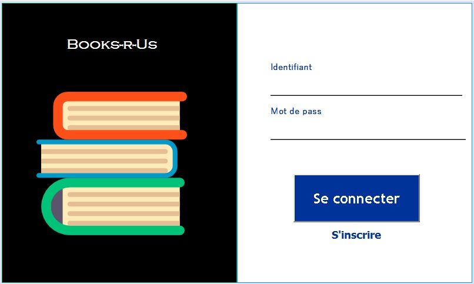
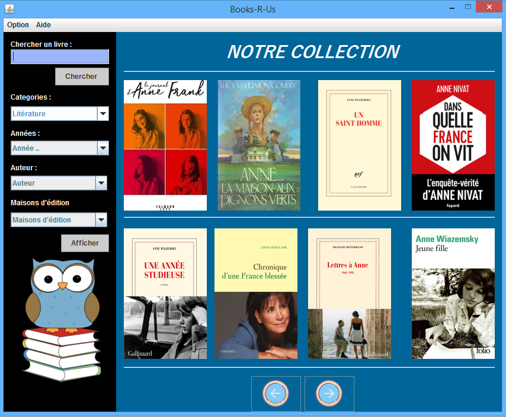

# Book-Library-in-Java-Swing

### Description:

Books-R-Us is a JAVA application developped on Netbeans.

it offers a very simple interface to view a library of EBooks.

## Screenshots: 

  
  

## Contributions:

Adding a back-end:
* Creating an account and singing in .
* Searching books.
* Reirecting to websites with an actual version of the EBook to read or download.
